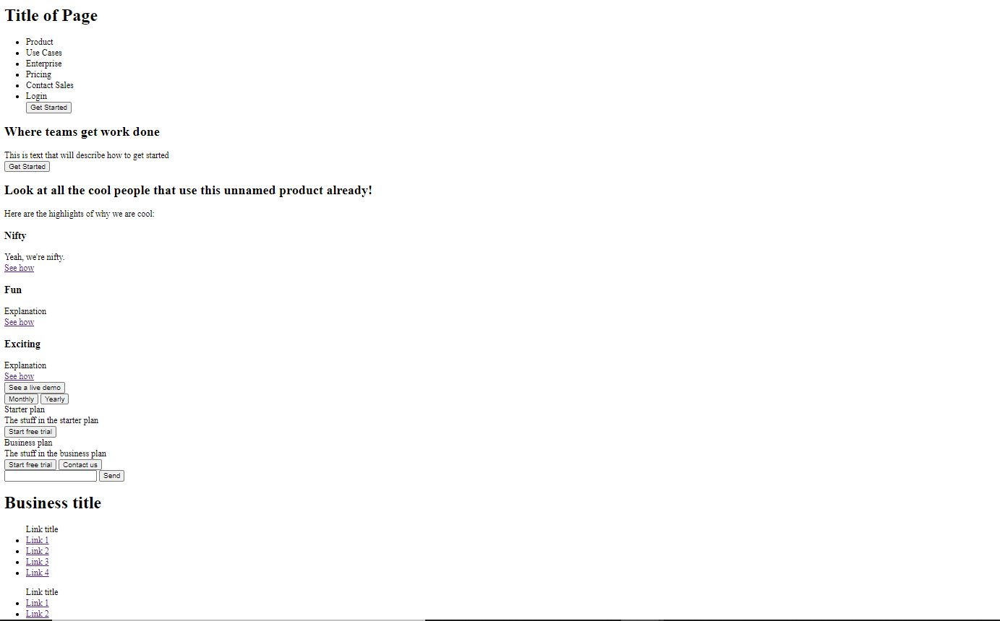

# Title

Here is my website for CS52 Lab 1, for a wedding planning business called "When's the Wedding?".

[When's the Wedding?](https://dartmouth-cs52-20x.github.io/lab1-landingpage-jordantsanz/)

I mimicked a mixture of [Patagonia](https://www.patagonia.com/home/), [Monday.com](https://monday.com/), [SimpleAnalytics](https://simpleanalytics.com/), and [Figma](https://www.figma.com/). 

## What Worked Well
The CSS transitions worked really well. The background covers as well worked perfectly, and the parallax scrolling looked amazing. The checkbox hack also worked surprisingly well, after I figured it out. Using the vw and vh parameters when talking about sizing worked well for resizing to a mobile screen.

## What Didn't
I really wanted to have my navbar fixed at the top and transparent when there hadn't been scrolling, and then for it to move with the user and color in white when there was scrolling, but this didn't work in css. Additionally, there were times where flexboxes were a bit annoying with positioning parameters. The carosel was tricky as well, because I couldn't use javascript; I also wanted to stylize the scrollbar, but I couldn't figure out how. 

There were also very few gay weddings online as free pictures. THIS WAS DISAPPOINTING. 

## Extra Credit
Here's a list of the extra-credit that I implemented:
- Mobile:
  - There is a hamburger menu!! Woohoo!!
  - There are also expandable and collapsable links in the footer on the hamburger menu
- Regular features:
  - There is a scrollable picture carosel, made with CSS
- CSS Transitions:
  - The navbar is transparent when not hovering over it, and then it becomes white when you do hover over it
     - the font colors of the text on the navbar change colors with this, too
  - The words on the navbar will slightly change color, size, and boldness when hovering over them
  - The buttons have smooth transitions when hovering over them
  - When you scroll down the page, each one of the three "steps" that you hover over, the font color changes to white and the font-size grows 
     - there is also a small delay on an underline of the last sentence of the description of each step
  - On each picture of a wedding in the carosel, there is a little description box that will expand when hovering over that picture, and the button also has its own transition
  - The social media icons will rotate slightly when hovering over them
  - The footer links will change color when hovering over them
  - There are smooth transitions on the hamburger menu in mobile and the expandable links in the footer in mobile, including movement and pretty white borders that appear

## Pre-CSS Screenshots

## Special Screenshots

- Jordan
